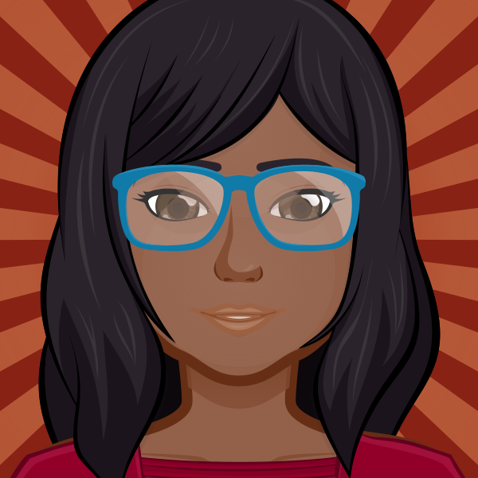

## 👋🏾&nbsp;Hi! I'm a frontend developer with a multimedia background
 
  - 👩🏾‍💻&nbsp;I started learning to code in 2018.
  - 🎓&nbsp;I'm studying Fullstack Web Development through self-paced programs.
  - 🎯&nbsp;I'm currently learning new languages while advancing my knowledge in "old" ones.
  - 🚀&nbsp;I've joined [Collab Labs](https://the-collab-lab.codes) to get real-world teamwork and Agile experience by building a collaborative React project. 
  - 🚀&nbsp;I'm participating in Hacktoberfest to become more active in open-source contributions. 
  - 💼&nbsp;Currently a Digital Content and Wordpress Lead who is looking for a frontend web developer position that will allow me to grow and contribute.

## 🏆&nbsp;Languages

  
  
  
  

## ⚙️&nbsp;Frameworks/ Libraries

  
  
  
  

## 🧰&nbsp;Tools

  
  
  
  
  
  
  
  
  
  
  
  
  

## 📖&nbsp;Currently (or will soon be) learning

  
  
  
  
  
  
  
  

## 📈&nbsp;My GitHub stats

<!--Dracula color theme for stats-->
<!--  -->
<!--Styled top languages with website color scheme -->
<!--  -->

<!--Profile Views but now I have 0 apparently-->
<!--  -->

## 💬&nbsp;Let's get in touch

&nbsp;&nbsp;
&nbsp;&nbsp;
&nbsp;&nbsp;

